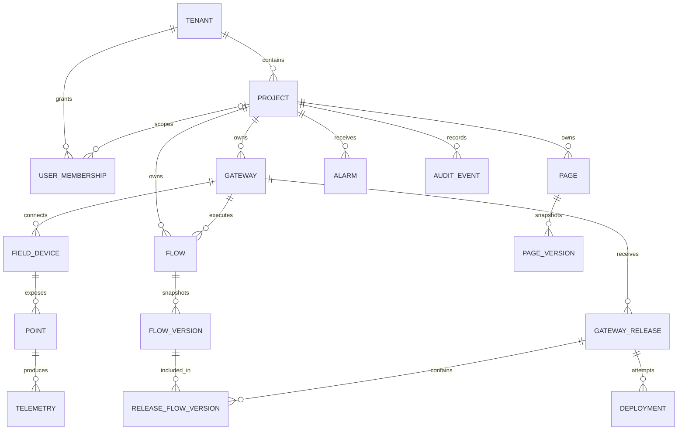

# ELSDTU 业务模型 v0.1

状态：设计初稿。依据[需求边界 v0.1](01-需求边界.md)，用于指导原型配置和后续接口设计；不是已落地的数据库结构。首版按单租户部署，保留租户边界。首批协议暂按 Modbus TCP 模拟器验证。

## 1. 模型边界

- **管理对象**：租户、项目、网关、现场设备、点位、流程、组态页面。
- **运行记录**：遥测数据、告警、发布任务、审计事件。运行记录不应与配置草稿混为一体。
- **云边分工**：云端保存草稿与不可变版本；网关只接收经过校验的发布包，并报告实际生效版本。
- **身份原则**：内部 ID 不随名称变化。名称用于展示，业务编码用于导入和对接。

## 2. 实体关系

说明：`USER_MEMBERSHIP` 可为租户级或项目级授权，具体身份系统待选型。`RELEASE_FLOW_VERSION` 表示发布包包含多个流程版本，首版可作为发布清单实现。`TELEMETRY` 是逻辑实体，实际可分为最新值与历史时序数据。组态页面与点位为**版本内容中的引用关系**，不要求为每个组件单独建业务表。

## 3. 主数据与关键字段

所有实体的 `id` 建议使用 UUID；时间统一保存 UTC，界面按用户时区展示。`created_at`、`updated_at` 等通用字段在下表省略。

| 实体 | 关键字段 | 约束与用途 |
| --- | --- | --- |
| `tenant` 租户 | `id`, `code`, `name`, `status` | `code` 全局唯一；首版只有一个租户，但数据均有归属 |
| `project` 项目 | `id`, `tenant_id`, `code`, `name`, `status` | 同租户内 `code` 唯一；项目是网关、流程和页面的主要权限边界 |
| `user_membership` 成员授权 | `id`, `tenant_id`, `project_id?`, `user_id`, `role` | `project_id` 为空表示租户级授权；首版角色沿用需求文档 |
| `gateway` 网关 | `id`, `tenant_id`, `project_id`, `serial_no`, `name`, `model`, `agent_version`, `status`, `last_seen_at`, `reported_release_id?` | `serial_no` 在租户内唯一；`last_seen_at` 是观测值，在线状态由心跳超时计算；不存明文密钥 |
| `field_device` 现场设备 | `id`, `tenant_id`, `project_id`, `gateway_id`, `code`, `name`, `protocol`, `connection_config`, `status` | 同网关内 `code` 唯一；`connection_config` 是受控配置，凭据另存安全存储 |
| `point` 点位 | `id`, `tenant_id`, `project_id`, `device_id`, `code`, `name`, `address`, `data_type`, `access_mode`, `unit?`, `sample_interval_ms?`, `enabled` | 同设备内 `code` 唯一；`address` 语义由协议驱动解释；首版 `access_mode=read` |
| `flow` 流程 | `id`, `tenant_id`, `project_id`, `gateway_id`, `code`, `name`, `draft_graph`, `status` | 首版一条流程属于一台网关；跨网关模板留待后续；草稿可编辑 |
| `flow_version` 流程版本 | `id`, `flow_id`, `version_no`, `graph_snapshot`, `content_hash`, `validation_result`, `created_by` | 同流程内版本号唯一；发布后内容不可修改；点位引用使用稳定 ID |
| `gateway_release` 网关发布包 | `id`, `gateway_id`, `release_no`, `device_point_snapshot`, `flow_version_ids`, `content_hash`, `created_by` | 同网关内版本号唯一；把点位配置和流程版本固化为一个一致的包，避免流程引用已改动点位 |
| `deployment` 发布任务 | `id`, `gateway_release_id`, `gateway_id`, `request_id`, `status`, `requested_at`, `ack_at?`, `failure_reason?` | 每次下发或回滚单独记录；`request_id` 用于去重和云边回执关联 |
| `page` 组态页面 | `id`, `tenant_id`, `project_id`, `code`, `name`, `draft_layout`, `status` | 同项目内 `code` 唯一；页面草稿与流程草稿分别管理 |
| `page_version` 页面版本 | `id`, `page_id`, `version_no`, `layout_snapshot`, `content_hash`, `published_at?` | 布局和点位绑定一同固化；已发布版本不可修改 |

首版 `connection_config`、`draft_graph` 和 `draft_layout` 可用结构化 JSON 表达，但必须有 schema 校验和版本字段，不能把任意 JSON 直接交给网关执行。具体数据库类型待第 3～5 步验证后定。

## 4. 运行数据与操作记录

| 实体 | 关键字段 | 约束与用途 |
| --- | --- | --- |
| `telemetry` 遥测 | `point_id`, `gateway_id`, `sampled_at`, `received_at`, `value`, `quality`, `sequence_no?` | 同一点位按采样时间查询；`sampled_at` 为现场时间，`received_at` 为云端接收时间；`quality` 区分正常、异常、过期 |
| `alarm` 告警 | `id`, `project_id`, `gateway_id`, `point_id?`, `flow_version_id?`, `event_key`, `severity`, `status`, `raised_at`, `cleared_at?`, `ack_by?` | `event_key` 避免断线补传生成重复告警；告警触发、恢复与人工确认分别记录 |
| `audit_event` 审计 | `id`, `tenant_id`, `project_id?`, `actor_id`, `action`, `target_type`, `target_id`, `occurred_at`, `result`, `request_id?` | 发布、回滚、修改点位和设备写入必须可追踪；审计事件追加写入 |

遥测数据量通常远大于主数据。逻辑模型先定义其身份与时间语义，存储实现由原型阶段根据实际网关数、点位数和采样频率选定。

## 5. 状态与生命周期

| 对象 | 状态或阶段 | 关键规则 |
| --- | --- | --- |
| 网关 | `unregistered → active → disabled`；在线/离线是单独的观测状态 | 注册身份与在线状态不能混用；离线不等于注销 |
| 现场设备 | `configured → collecting`，可暂停或报错 | 设备通讯异常不改变网关的注册状态 |
| 流程与页面 | `draft → validated → published` | 每次发布生成新版本；编辑只改草稿 |
| 发布任务 | `pending → sent → acknowledged → applied`；或 `failed/timeout` | 云端“已发送”不等于网关“已生效”；实际生效版本以网关回报为准 |
| 告警 | `active → recovered`，人工确认标记可独立发生 | 恢复与确认是不同含义，需分别保存 |

回滚**不删除历史版本**：创建一个指向历史有效内容的新发布任务。网关校验通过后原子切换生效包；失败时继续执行原包，并回传原因。

## 6. 跨实体约束

1. 网关、设备、点位、流程和页面的引用必须位于同一项目；任何跨租户引用直接拒绝。
2. 流程版本引用的点位必须属于目标网关，且在发布包的点位快照中存在、类型兼容。
3. 页面版本可以引用本项目多台网关的点位；删除或停用点位时先提示受影响的流程和页面。
4. 业务删除默认先停用，不立即清理发布版本、遥测、告警和审计记录。
5. 云端的目标发布版本与网关报告的实际版本分别保存，用于展示发布中、失败和配置漂移。
6. 网关重发遥测或回执应幂等处理；不能把网络重试当作新的流程版本或新的告警。

## 7. 用一个实例检查模型

假设租户 `T1` 下有项目 `P1`，项目中有网关 `G1`；`G1` 连接设备 `D1`，设备有温度点位 `Q1`。实施工程师创建流程 `F1`：`Q1` 连续 3 次超过阈值时告警。

1. `F1` 的草稿校验后生成不可变的 `flow_version V1`，引用 `Q1`。
2. 云端将 `D1/Q1` 的配置快照和 `V1` 组成 `gateway_release R1`，生成发布任务 `DEP1`。
3. `G1` 验证 `R1`，成功后上报 `reported_release_id=R1`。断网时仍按 `R1` 运行。
4. 温度采样写入遥测，触发的告警关联 `G1`、`Q1` 与 `V1`；项目页面的已发布版本可展示该点位和告警。
5. 若后续发布 `R2` 失败，`DEP2` 标记失败，`G1` 的实际版本仍为 `R1`。

## 8. 与候选平台的映射（待原型核实）

ThingsBoard 的租户、设备、资产、规则链和仪表盘可作为原型能力来源。ELSDTU 的 `gateway_release`、`deployment` 和“目标版本/实际版本”是需要重点验证的云边发布语义；不能仅凭相似名称认定平台原生支持。第 3～5 步应记录对应实体或扩展实现方式。

## 9. 仍待确认的模型决策

- 一台网关是否允许跨项目共享？当前模型规定只属于一个项目。
- 下挂设备是否可能迁移到另一网关？当前模型要求重新绑定并生成新发布包。
- 设备控制写入何时进入范围？当前只设计 `read` 点位，写入权限和联锁规则留待业务确认。
- 多租户是否为正式产品需求？当前只预留边界，首版不实现完整计费与租户自助服务。

## 10. 第 2 步完成判定

- 所有首版核心对象都有归属、标识和关键字段。
- 场景 A～D 可沿实体关系追踪到配置、运行数据和操作记录。
- 发布、失败、断网与回滚都有明确的目标版本和实际版本语义。
- 未确定的平台映射和业务规则已标为待验证，不阻塞第 3 步搭建原型。
